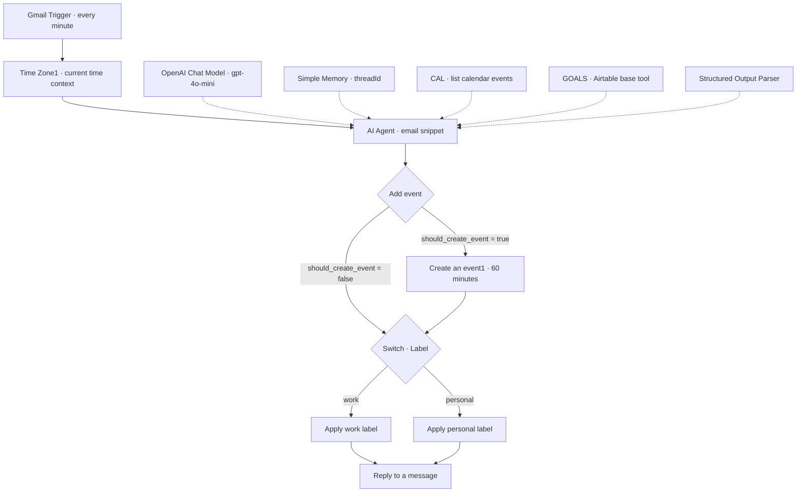
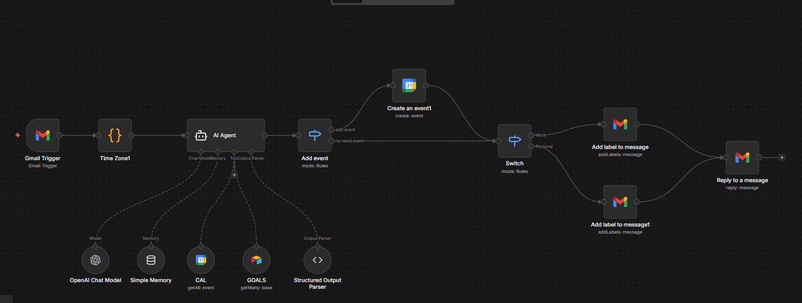

<div align="center">

# AI Email Agent

### Email triage, contextual replies, and calendar scheduling with n8n

**n8n · OpenAI · Gmail · Google Calendar · Airtable**

[Workflow](Agent%20Email.json) · [Architecture](#architecture) · [Setup](#getting-started) · [Safe testing](#safe-testing) · [Limitations](#limitations-and-next-steps)

</div>

---

## Overview

AI Email Agent connects a Gmail inbox to an n8n AI Agent that classifies messages as **work** or **personal**, generates a reply, and makes a scheduling decision using calendar and goals tools. The workflow combines a structured model response with explicit routing, Gmail labels, and a Google Calendar event-creation branch.

This repository contains the **14-node workflow export** and a visual overview. It is a starting point for inspecting and adapting an email automation, with configuration and safety checks required before live use.

> [!WARNING]
> **This workflow can send email and create calendar events automatically.** Both label branches lead to the Gmail reply node. There is no human-approval step or `requires_reply` check in the export. Start with isolated test accounts, and add an approval gate before connecting a real inbox.
>
> The JSON contains `active: false`. That describes the exported file only; it does not establish the state of any deployed copy. Manual execution can still perform writes.

## What is included

| Component | Behavior in the exported workflow |
| --- | --- |
| Gmail trigger | Polls every minute, with no additional trigger filters configured |
| Time context | Supplies a UTC ISO timestamp and the JavaScript runtime's timezone |
| AI Agent | Uses the Gmail message **snippet** as input and `gpt-4o-mini` as the configured model |
| Thread memory | Uses Gmail `threadId` as the session key, with a context window of 10 previous interactions |
| Calendar tool (`CAL`) | Lists events for a time window selected by the agent |
| Goals tool (`GOALS`) | Connects an Airtable tool at the **base** resource level; goals-record retrieval still needs configuration |
| Structured output | Produces reply text, a label, and scheduling fields |
| Calendar branch | Creates a **60-minute event** when `should_create_event` is `true` |
| Gmail actions | Applies one of two configured label IDs, then replies to the triggering message |

**Airtable is connected as an agent tool.** The export does not include an email-metadata logging step, a goals-table schema, or a configured active-goals record query.

## Architecture



Solid arrows show execution flow. Dotted arrows show the model, memory, tools, and parser attached to the agent. The [workflow JSON](Agent%20Email.json) is the source of truth for node settings and connections.

<details>
<summary><strong>View the n8n workflow screenshot</strong></summary>



</details>

### Scheduling logic

The agent prompt asks the model to consult calendar and goals tools, resolve a future date and time, and consider goal alignment before requesting an event. The downstream `Add event` switch checks only the model's `should_create_event` boolean. These prompt instructions are **not independent validation or an approval boundary**.

On the event branch, the workflow uses `resolved_date` and `resolved_time` for the start, adds one hour for the end, and uses `summary_event` for both the title and description. It then continues to labeling and replying. No event attendees are configured.

## Getting started

### 1. Prepare the integrations

You need an n8n instance with the node types and versions used in the export, plus access to the following services. The repository does not pin a tested n8n release or include a separate application to install.

| Service | Configure in n8n | Used by |
| --- | --- | --- |
| Gmail | Your own Gmail OAuth2 credential and two labels in a dedicated test mailbox | Trigger, both label nodes, reply node |
| OpenAI | Your own OpenAI credential with access to the configured model, or an explicitly selected replacement | OpenAI Chat Model |
| Google Calendar | Your own Google Calendar OAuth2 credential and an isolated test calendar | `CAL` and `Create an event1` |
| Airtable | Your own Airtable credential and an appropriate goals data source | `GOALS` |

Create or select credentials through **n8n's credential UI**. Never paste API keys, access tokens, or OAuth secrets into this README, workflow expressions, or commits. Credential references in the export belong to the original instance and must be reassigned.

### 2. Import the workflow

1. Download [Agent Email.json](Agent%20Email.json).
2. Open a new workflow in n8n and choose **Import from File** from the editor menu. See the official [n8n import guide](https://docs.n8n.io/build/manage-workflows/export-and-import.md).
3. Keep the imported copy **inactive or unpublished** and resolve any unknown-node or version warnings before running it.
4. Reassign the four service credentials in every relevant node.

### 3. Replace instance-specific settings

- **Gmail labels:** Select your own labels in `Add label to message` and `Add label to message1`. The switch matches the exact lowercase values `work` and `personal`; the stored label IDs are account-specific.
- **Calendar:** Select your test calendar in both `CAL` and `Create an event1`. Do not retain the original calendar selection.
- **Goals:** Inspect `GOALS`. It currently selects the Airtable `base` resource and does not retrieve a defined goals table. Configure and verify goals-record retrieval before relying on `goal_match` for scheduling. No required table schema is supplied.
- **Timezone:** Review the exported `America/Los_Angeles` workflow setting, the runtime timezone returned by `Time Zone1`, and calendar behavior together. Event expressions construct JavaScript dates without an explicit UTC offset, so timezone and daylight-saving behavior need testing.
- **Prompt:** Adapt the reply style and scheduling criteria to your use case. Review the relative-date instructions, which refer to both the current timestamp and prior proposed times.
- **Trigger scope:** Restrict the test copy to messages you control. The original trigger has no additional filters.

## Structured output

The agent prompt and parser use these seven fields. Downstream expressions read them under the AI Agent's `output` property.

| Field | Type | Purpose |
| --- | --- | --- |
| `Response` | string | Plain-text body passed to Gmail's reply operation |
| `Label` | string | `work` or `personal`, matched case-sensitively |
| `should_create_event` | boolean | Controls the calendar branch |
| `goal_match` | boolean | Agent's goal-alignment assessment; not independently checked by the switch |
| `summary_event` | string | Event title and description; the prompt requests an empty string when no event is needed |
| `resolved_date` | string | `YYYY-MM-DD`, or an empty string when no event is needed |
| `resolved_time` | string | `HH:MM` in 24-hour format, or an empty string when no event is needed |

### Synthetic example

For a fictional message such as “Could we schedule a project review?”, a schema-shaped response could be:

```json
{
  "Response": "Hello, could you share a preferred date, time, and time zone for the project review? Thank you.",
  "Label": "work",
  "should_create_event": false,
  "goal_match": false,
  "summary_event": "",
  "resolved_date": "",
  "resolved_time": ""
}
```

This is an illustrative example, not a recorded execution or guaranteed model output. It skips event creation, but the work-label branch still proceeds to **send the reply** if executed successfully.

## Safe testing

Keep the workflow inactive throughout initial testing. Inactive status prevents scheduled operation; it does **not** make a manual run read-only.

1. **Make an isolated test copy.** Use a mailbox and calendar containing no real correspondence or appointments.
2. **Disconnect the write paths first.** In the test copy, stop before the calendar-creation, label, and reply nodes. Inspect the trigger, time context, tool results, and structured output without executing those actions.
3. **Use synthetic messages and goals.** Check work/personal classification, a missing date, a past date, a calendar conflict, and a request with no goal match. Test relative dates and daylight-saving boundaries separately.
4. **Check thread behavior.** Verify that separate threads use separate memory keys and that follow-up messages do not depend on unavailable history. No node fetches an entire Gmail thread in this export.
5. **Test writes only in isolation.** When intentionally testing the action nodes, verify the exact test message, label, calendar, start/end times, and reply body before execution. Re-running can repeat side effects.
6. **Add and test approval controls before live use.** Confirm that rejected or uncertain decisions cannot reach either write path, then review the full execution before enabling automatic operation.

The repository does not include an automated test suite or live-run evidence. Import success alone does not validate reply quality, scheduling accuracy, or production readiness.

## Limitations and next steps

The following improvements are **not implemented in the supplied export**:

- **Human approval and reply eligibility:** Add a review gate before replies and event creation, plus a separate decision for whether an email needs a reply.
- **Deterministic scheduling validation:** Validate future timestamps, timezone offsets, event duration, and calendar conflicts outside the model. Reconcile the prompt's overlapping date-resolution rules.
- **Complete goals retrieval:** Define a goals schema and query the intended active records; do not assume the base-level Airtable tool provides them.
- **Input and output validation:** The model receives a snippet, not a fetched full email body. Add explicit content handling and validation for label values, dates, and reply text; the parser is not a semantic safety check.
- **Duplicate and loop prevention:** Add processed-message/event tracking and controls for automated senders. The export has no explicit deduplication or auto-reply-loop guard.
- **Failure handling and observability:** Add error routes, alerts, and intentional logging. Calendar creation can succeed before a later label or reply step fails.

Simple Memory also has deployment constraints: n8n advises against using it in active production workflows running in queue mode. See the official [Simple Memory documentation](https://docs.n8n.io/integrations/builtin/cluster-nodes/sub-nodes/n8n-nodes-langchain.memorybufferwindow/).

## Privacy and security

Email snippets, remembered thread context, and tool results can become model context. Review the data policies and access permissions of n8n and each connected provider before using real information. Treat incoming email as untrusted input: prompt instructions alone do not prevent malicious messages from influencing the agent.

Use least-privilege credentials, restrict access to execution history, and review exports and screenshots before sharing them. Workflow exports can retain account identifiers, credential names/IDs, and instance metadata. Keep secrets and private correspondence out of Git history.

## Repository contents

```text
RespondEmailAgent/
├── Agent Email.json   # Importable n8n workflow
├── workflow.png       # Workflow overview image
└── README.md          # Setup, behavior, and safety notes
```

## Author

Built by [Melody Nazar (@nzrnaghme)](https://github.com/nzrnaghme).

No license file is currently included in this repository. Contact the maintainer before assuming permission to redistribute or reuse the project.
